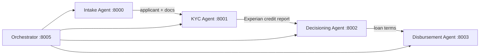
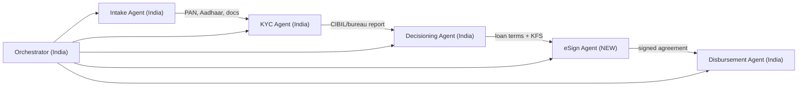

# BFSI-Agents India: Architecture Overview

## 1. Existing USA System Architecture

### Current Pipeline Flow (USA)
| Stage | Key Components | USA-Specific |
|-------|---------------|-------------|
| **Intake** | LoanApplication, Applicant, Document, Address, Employment, Income, Liability | SSN, ITIN, US State codes, ZIP codes, AAMVA barcode (DL), W2, tax returns |
| **KYC** | SSN node, Address node, AML node, Contact node, Face node | Experian vendor, SSN validation, USPS address, US phone E.164 |
| **Decisioning** | 7 parallel risk nodes → aggregator → LLM decision → counter-offer | Experian FICO score, US credit bureau data |
| **Disbursement** | validate → schedule → transfer → receipt | NEFT mock, USD amounts |
| **Orchestrator** | SSE progress, counter-offer flow, approval confirmation | USD formatting, US data mappers |

---

## 2. India System: High-Level Delta

### Key Differences Summary

| Area | USA (Current) | India (New) |
|------|--------------|-------------|
| **Identity** | SSN / ITIN | Aadhaar (12-digit) / PAN (ALPHANUMERIC) |
| **ID Documents** | Driver's License, Passport, SSN Card | Aadhaar, PAN, Voter ID, Driving License, Passport |
| **Address** | US States + ZIP (5/9 digit) | Indian States/UTs + PIN code (6 digit) |
| **Phone** | +1XXXXXXXXXX | +91XXXXXXXXXX |
| **Credit Bureau** | Experian (USA) | CIBIL / Experian India / CRIF / Equifax India |
| **KYC Method** | SSN + Experian lookup | eKYC (Aadhaar OTP), Video KYC (V-CIP), CKYC, DigiLocker |
| **OCR** | AWS Textract (English) | Google Vision / Bhashini / Tesseract (Hindi + English) |
| **Document Validation** | AAMVA barcode, SSN regex | Aadhaar Verhoeff, PAN regex, QR code on Aadhaar |
| **Regulatory** | FCRA, ECOA, TILA | RBI KYC Directions 2025, Digital Lending Guidelines |
| **Decision Rules** | US credit norms | RBI NPA norms, FLDG caps, interest rate guidelines |
| **Pre-Disbursement** | None (direct) | Aadhaar eSign / DSC on loan agreement (mandatory) |
| **Disbursement** | Mock NEFT | NEFT/RTGS/IMPS/UPI to borrower's bank account |
| **Repayment** | Not implemented | NACH e-mandate setup |
| **Currency** | USD ($) | INR (₹) |
| **Data Residency** | No restriction | Must be stored on servers in India (RBI mandate) |
| **Encryption** | Vault (existing) | All KYC data encrypted at rest + in transit (mandatory) |

---

## 3. Sprint Plan Overview

| Sprint | Duration | Focus |
|--------|----------|-------|
| **Sprint 1** | 2 weeks | Intake Agent India — models, validators, ZIP upload, Hindi OCR |
| **Sprint 2** | 2 weeks | KYC Agent India — eKYC, Video KYC, face dedup, encryption |
| **Sprint 3** | 2 weeks | Decisioning Agent India — RBI rule engine, CIBIL integration, LLM guardrails |
| **Sprint 4** | 2 weeks | eSign + Disbursement Agent India — Aadhaar eSign, NEFT/RTGS, NACH |
| **Sprint 5** | 1 week | Orchestrator India — data mappers, pipeline, integration testing |
| **Sprint 6** | 1 week | Security hardening, encryption audit, compliance testing |

> Total: **10 weeks** (5 development sprints + 1 hardening sprint)
