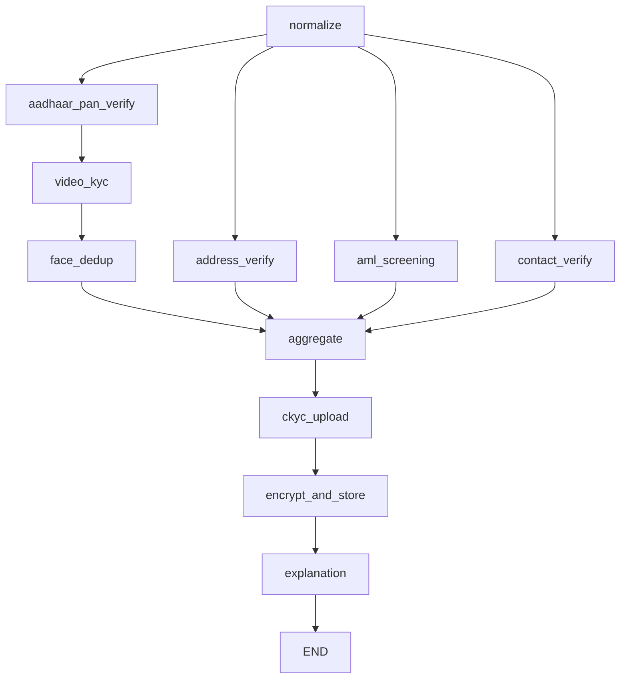

# Sprint 2: KYC Agent — India Adaptation (2 Weeks)

## 2.1 KYC Process Changes: USA → India

| USA (Current) | India (New) |
|---------------|-------------|
| SSN → Experian lookup | Aadhaar eKYC (UIDAI OTP) / Video KYC (V-CIP) |
| SSN Validation node | Aadhaar + PAN Verification node |
| Address via Experian match | Address via Aadhaar eKYC / DigiLocker / India Post API |
| Face liveness (commented out) | **Mandatory** face liveness + face deduplication |
| Contact (US phone, MX check) | Contact (Indian phone, UPI handle validation) |
| AML (OFAC/SDN lists) | AML (RBI sanctions, UNSC list, Indian watchlists) |
| No CKYC | CKYC upload mandatory (Central KYC Registry) |
| No Video KYC | Video KYC (V-CIP) as primary onboarding method |

## 2.2 New KYC Workflow Graph



### Node Definitions

```python
# workflows/decision_flow.py (India)
def build_graph():
    graph = StateGraph(KYCState)

    graph.add_node("normalize", normalize_node)
    graph.add_node("aadhaar_pan_verify", aadhaar_pan_node)   # NEW: replaces ssn_node
    graph.add_node("address_verify", address_node)            # Modified for India
    graph.add_node("aml_screening", aml_india_node)           # Modified watchlists
    graph.add_node("contact_verify", contact_node)            # Modified for +91
    graph.add_node("video_kyc", video_kyc_node)               # NEW
    graph.add_node("face_dedup", face_dedup_node)             # NEW
    graph.add_node("aggregate", risk_aggregator_node)
    graph.add_node("ckyc_upload", ckyc_upload_node)           # NEW
    graph.add_node("encrypt_and_store", encrypt_store_node)   # NEW
    graph.add_node("explanation", explanation_node)

    graph.set_entry_point("normalize")

    # Parallel fan-out
    graph.add_edge("normalize", "aadhaar_pan_verify")
    graph.add_edge("normalize", "address_verify")
    graph.add_edge("normalize", "aml_screening")
    graph.add_edge("normalize", "contact_verify")

    # Sequential: Aadhaar → Video KYC → Face Dedup
    graph.add_edge("aadhaar_pan_verify", "video_kyc")
    graph.add_edge("video_kyc", "face_dedup")

    # Fan-in to aggregate
    graph.add_edge("face_dedup", "aggregate")
    graph.add_edge("address_verify", "aggregate")
    graph.add_edge("aml_screening", "aggregate")
    graph.add_edge("contact_verify", "aggregate")

    # Post-aggregate: CKYC upload → Encrypt → Explain
    graph.add_edge("aggregate", "ckyc_upload")
    graph.add_edge("ckyc_upload", "encrypt_and_store")
    graph.add_edge("encrypt_and_store", "explanation")
    graph.add_edge("explanation", END)

    return graph.compile(checkpointer=checkpointer)
```

---

## 2.3 Aadhaar + PAN Verification Node

```python
# workflows/kyc_engine/nodes/aadhaar_pan.py

async def aadhaar_pan_node(state: KYCState) -> dict:
    """
    Replaces SSN node. Verifies Aadhaar via UIDAI eKYC (OTP) and PAN via NSDL API.
    """
    request = state["raw_request"]

    # 1. Aadhaar Verification via UIDAI eKYC (OTP-based)
    aadhaar_result = await uidai_ekyc_service.verify(
        aadhaar_number=request["aadhaar_number"],
        otp=request.get("aadhaar_otp"),  # OTP sent to Aadhaar-linked mobile
    )

    # 2. PAN Verification via NSDL/UTIITSL API
    pan_result = await pan_verification_service.verify(
        pan_number=request["pan_number"],
        name=request["full_name"],
        dob=request["dob"],
    )

    # 3. PAN-Aadhaar linkage check (mandatory per IT Act)
    pan_aadhaar_linked = await pan_aadhaar_link_service.check(
        pan=request["pan_number"], aadhaar=request["aadhaar_number"]
    )

    # 4. Age validation
    from datetime import date, datetime
    dob = datetime.strptime(request["dob"], "%Y-%m-%d").date()
    age = (date.today() - dob).days // 365
    flags = {}
    if age < 18: flags["AGE_BELOW_MIN"] = "Applicant under 18"
    if age > 100: flags["AGE_SUSPICIOUS"] = "Age exceeds 100"

    return {
        "aadhaar_verification": {
            "verified": aadhaar_result.get("status") == "SUCCESS",
            "name_match": aadhaar_result.get("name_match", False),
            "dob_match": aadhaar_result.get("dob_match", False),
            "address_from_aadhaar": aadhaar_result.get("address"),
            "photo_base64": aadhaar_result.get("photo"),  # For face match
        },
        "pan_verification": {
            "verified": pan_result.get("valid", False),
            "name_match": pan_result.get("name_match", False),
            "pan_status": pan_result.get("status"),  # ACTIVE, INACTIVE, FLAGGED
            "pan_aadhaar_linked": pan_aadhaar_linked,
        },
        "identity_flags": flags,
    }
```

---

## 2.4 Video KYC (V-CIP) Implementation

### RBI V-CIP Requirements (all mandatory)
1. **Live real-time video** — no pre-recorded videos
2. **Authorized RE official** conducts the call
3. **Explicit recorded consent** at session start
4. **Geo-tagging** — GPS coordinates, must be within India
5. **Liveness detection** — AI-based, passive + active
6. **OVD capture** — live capture of Aadhaar/PAN during session
7. **End-to-end encryption** of video stream
8. **Tamper-proof audit trail** stored for 8 years

```python
# services/video_kyc_service.py

class VideoKYCService:
    """Integrates with V-CIP provider (e.g., Signzy, HyperVerge, IDfy)."""

    def __init__(self, provider_url: str, api_key: str):
        self.provider_url = provider_url
        self.api_key = api_key

    async def initiate_session(self, applicant_id: str, aadhaar_photo_b64: str) -> dict:
        """Create a V-CIP session. Returns session URL for the customer."""
        payload = {
            "applicant_id": applicant_id,
            "reference_photo": aadhaar_photo_b64,  # From eKYC
            "consent_required": True,
            "geo_tagging_required": True,
            "liveness_check": "PASSIVE_AND_ACTIVE",
            "ovd_capture": True,
            "session_timeout_seconds": 600,
        }
        async with httpx.AsyncClient() as client:
            resp = await client.post(f"{self.provider_url}/v-cip/sessions", json=payload,
                                     headers={"Authorization": f"Bearer {self.api_key}"})
            return resp.json()  # {"session_id": "...", "customer_url": "https://...", "agent_url": "..."}

    async def get_session_result(self, session_id: str) -> dict:
        """Poll/webhook for V-CIP result."""
        async with httpx.AsyncClient() as client:
            resp = await client.get(f"{self.provider_url}/v-cip/sessions/{session_id}/result",
                                    headers={"Authorization": f"Bearer {self.api_key}"})
            return resp.json()
            # Returns: {
            #   "status": "COMPLETED"|"FAILED"|"REJECTED",
            #   "liveness_score": 0.98,
            #   "face_match_score": 0.95,
            #   "geo_location": {"lat": 28.6139, "lon": 77.2090},
            #   "consent_recorded": True,
            #   "ovd_captured": True,
            #   "video_recording_url": "s3://...",  # encrypted
            #   "audit_trail_hash": "sha256:...",
            # }
```

---

## 2.5 Face Deduplication Verification

```python
# services/face_dedup_service.py

class FaceDeduplicationService:
    """
    Compares applicant face against existing customer database to detect
    duplicate identities. Uses face embeddings stored in a vector DB.
    """

    def __init__(self, vector_db_client, similarity_threshold: float = 0.85):
        self.vector_db = vector_db_client  # e.g., Pinecone, Milvus, pgvector
        self.threshold = similarity_threshold

    async def check_duplicate(self, applicant_id: str, face_image_b64: str) -> dict:
        # 1. Generate face embedding using DeepFace / InsightFace / ArcFace
        embedding = await self._generate_embedding(face_image_b64)

        # 2. Search vector DB for similar faces
        matches = await self.vector_db.search(
            vector=embedding, top_k=5, threshold=self.threshold
        )

        is_duplicate = len(matches) > 0
        flags = {}
        if is_duplicate:
            flags["FACE_DEDUP_ALERT"] = f"Face matches {len(matches)} existing record(s)"

        # 3. Store embedding for future dedup (only if not duplicate)
        if not is_duplicate:
            await self.vector_db.upsert(id=applicant_id, vector=embedding)

        return {
            "is_duplicate": is_duplicate,
            "matching_applicant_ids": [m["id"] for m in matches],
            "highest_similarity": matches[0]["score"] if matches else 0.0,
            "flags": flags,
        }

    async def _generate_embedding(self, face_b64: str) -> list[float]:
        """Generate 512-dim face embedding using InsightFace/ArcFace."""
        import base64, numpy as np
        from insightface.app import FaceAnalysis
        img_bytes = base64.b64decode(face_b64)
        # ... process and return embedding vector
```

---

## 2.6 Mandatory KYC Data Encryption

> **RBI Mandate**: All KYC data must be encrypted at rest and in transit.

### Encryption Architecture

```python
# services/kyc_encryption_service.py
from cryptography.fernet import Fernet
from cryptography.hazmat.primitives.ciphers.aead import AESGCM
import os, base64

class KYCEncryptionService:
    """AES-256-GCM encryption for all KYC PII data."""

    def __init__(self, master_key: bytes):
        self.master_key = master_key  # From Vault / AWS KMS / Azure Key Vault

    def encrypt_field(self, plaintext: str) -> str:
        """Encrypt a single PII field (Aadhaar, PAN, etc.)."""
        nonce = os.urandom(12)
        aesgcm = AESGCM(self.master_key)
        ciphertext = aesgcm.encrypt(nonce, plaintext.encode(), None)
        return base64.b64encode(nonce + ciphertext).decode()

    def decrypt_field(self, encrypted: str) -> str:
        """Decrypt a single PII field."""
        raw = base64.b64decode(encrypted)
        nonce, ciphertext = raw[:12], raw[12:]
        aesgcm = AESGCM(self.master_key)
        return aesgcm.decrypt(nonce, ciphertext, None).decode()

    def encrypt_kyc_payload(self, kyc_data: dict) -> dict:
        """Encrypt all PII fields in a KYC result before storage/transmission."""
        PII_FIELDS = ["aadhaar_number", "pan_number", "full_name", "dob",
                       "address", "phone", "email", "photo_base64",
                       "face_embedding", "video_recording_url"]
        encrypted = {}
        for key, value in kyc_data.items():
            if key in PII_FIELDS and value:
                encrypted[key] = self.encrypt_field(str(value))
            else:
                encrypted[key] = value
        encrypted["_encrypted_fields"] = [k for k in PII_FIELDS if k in kyc_data and kyc_data[k]]
        return encrypted
```

### Where Encryption is Applied

| Data Point | Encrypted At Rest | Encrypted In Transit | Storage |
|-----------|:-:|:-:|---------|
| Aadhaar Number | ✅ AES-256-GCM | ✅ TLS 1.3 | DB column `aadhaar_encrypted` |
| PAN Number | ✅ AES-256-GCM | ✅ TLS 1.3 | DB column `pan_encrypted` |
| Face Photo/Embedding | ✅ AES-256-GCM | ✅ TLS 1.3 | Object store (encrypted bucket) |
| Video KYC Recording | ✅ AES-256-GCM | ✅ TLS 1.3 | S3 with SSE-KMS |
| Aadhaar eKYC XML | ✅ AES-256-GCM | ✅ TLS 1.3 | Vault / encrypted blob |
| All inter-agent payloads | N/A | ✅ mTLS between agents | In-memory only |
