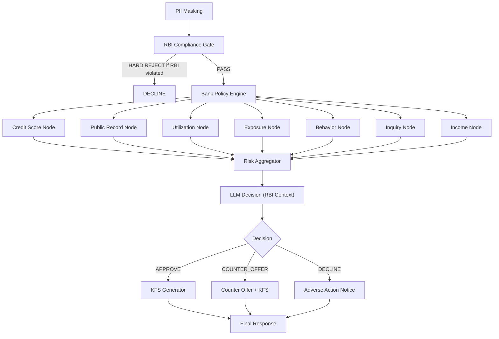

# Sprint 3: Decisioning Agent — India Adaptation (2 Weeks)

## 3.1 Architecture Change: RBI Rule Engine Layer Before LLM

### Current USA Flow
```
Raw Experian → [7 Risk Nodes] → Aggregator → LLM Decision → Counter-Offer → Final
```

### New India Flow (with Regulatory + Policy Layer)
```
Raw CIBIL → [PII Mask] → [RBI Compliance Gate] → [Bank Policy Engine] → [7 Risk Nodes] → Aggregator → [RBI-Aware LLM Decision] → Counter-Offer → KFS Generation → Final
```



---

## 3.2 RBI Compliance Gate (Pre-LLM Regulatory Layer)

```python
# domain/regulatory/rbi_compliance_gate.py

class RBIComplianceGate:
    """
    Hard-coded regulatory rules that CANNOT be overridden by LLM.
    These run BEFORE any credit risk evaluation.
    """

    def evaluate(self, applicant_data: dict, loan_request: dict) -> dict:
        violations = []
        warnings = []

        # --- 1. Age Rules ---
        age = applicant_data.get("age", 0)
        if age < 18:
            violations.append({"rule": "RBI_MIN_AGE", "detail": "Applicant must be 18+"})
        if age > 70:
            warnings.append({"rule": "RBI_MAX_AGE_WARNING", "detail": "Age > 70, limited tenure"})

        # --- 2. KYC Completion Check ---
        if not applicant_data.get("kyc_verified"):
            violations.append({"rule": "RBI_KYC_MANDATORY", "detail": "KYC not completed"})
        if not applicant_data.get("pan_verified"):
            violations.append({"rule": "RBI_PAN_MANDATORY", "detail": "PAN verification required"})

        # --- 3. NPA Check ---
        if applicant_data.get("is_npa", False):
            violations.append({"rule": "RBI_NPA_BLOCK", "detail": "Applicant is NPA with another lender"})

        # --- 4. Wilful Defaulter Check (RBI Master Circular) ---
        if applicant_data.get("wilful_defaulter", False):
            violations.append({"rule": "RBI_WILFUL_DEFAULTER", "detail": "Listed as wilful defaulter"})

        # --- 5. FLDG Cap (First Loss Default Guarantee) ---
        fldg_percentage = loan_request.get("fldg_percentage", 0)
        if fldg_percentage > 5.0:
            violations.append({"rule": "RBI_FLDG_CAP", "detail": "FLDG cannot exceed 5% of portfolio"})

        # --- 6. Loan Amount Limits (Product-specific) ---
        loan_type = loan_request.get("loan_type", "personal")
        amount = loan_request.get("amount", 0)
        limits = {"personal": 2500000, "gold": 5000000, "education": 10000000}
        if amount > limits.get(loan_type, float('inf')):
            warnings.append({"rule": "RBI_AMOUNT_LIMIT", "detail": f"Exceeds typical {loan_type} limit"})

        # --- 7. Interest Rate Reasonableness (Fair Practice Code) ---
        # Interest rate capping is checked post-decision

        # --- 8. Cooling-Off Period Check ---
        if applicant_data.get("recent_loan_days", 999) < 3:
            violations.append({"rule": "RBI_COOLING_OFF",
                              "detail": "3-day cooling-off period not elapsed since last loan"})

        hard_reject = len(violations) > 0
        return {
            "passed": not hard_reject,
            "violations": violations,
            "warnings": warnings,
            "gate_decision": "REJECT" if hard_reject else "PROCEED",
        }
```

---

## 3.3 Bank Policy Engine (Business Rules)

```python
# domain/regulatory/bank_policy_engine.py
import json
from pathlib import Path

class BankPolicyEngine:
    """
    Configurable business rules that vary per bank/NBFC.
    Loaded from JSON config, NOT hardcoded.
    """

    def __init__(self, config_path: str = "config/bank_policy.json"):
        with open(config_path) as f:
            self.policy = json.load(f)

    def evaluate(self, credit_score: int, dti: float, loan_request: dict) -> dict:
        product = loan_request.get("loan_type", "personal")
        product_policy = self.policy["products"].get(product, self.policy["products"]["default"])

        decisions = []

        # Credit score thresholds
        if credit_score < product_policy["min_cibil_score"]:
            decisions.append({"rule": "MIN_CIBIL", "action": "REJECT",
                             "detail": f"CIBIL {credit_score} < minimum {product_policy['min_cibil_score']}"})

        # DTI limits
        if dti > product_policy["max_dti"]:
            decisions.append({"rule": "MAX_DTI", "action": "COUNTER_OFFER",
                             "detail": f"DTI {dti:.1%} > max {product_policy['max_dti']:.1%}"})

        # Tenure limits
        tenure = loan_request.get("tenure_months", 0)
        if tenure > product_policy["max_tenure_months"]:
            decisions.append({"rule": "MAX_TENURE", "action": "CAP",
                             "detail": f"Tenure capped at {product_policy['max_tenure_months']} months"})

        # Interest rate floor/ceiling
        decisions.append({
            "rule": "RATE_BAND",
            "min_rate": product_policy["interest_rate_floor"],
            "max_rate": product_policy["interest_rate_ceiling"],
        })

        return {"product_policy": product_policy, "policy_decisions": decisions}
```

### Bank Policy Config (`config/bank_policy.json`)
```json
{
  "bank_name": "Example Bank India",
  "rbi_registration": "NBFC-SI-12345",
  "products": {
    "personal": {
      "min_cibil_score": 650,
      "max_dti": 0.50,
      "max_tenure_months": 60,
      "max_amount": 2500000,
      "min_amount": 10000,
      "interest_rate_floor": 10.5,
      "interest_rate_ceiling": 36.0,
      "processing_fee_percent": 2.0,
      "gst_on_fee_percent": 18.0,
      "prepayment_penalty": false,
      "foreclosure_allowed_after_months": 6
    },
    "home": {
      "min_cibil_score": 700,
      "max_dti": 0.45,
      "max_tenure_months": 360,
      "max_amount": 100000000,
      "interest_rate_floor": 8.5,
      "interest_rate_ceiling": 14.0,
      "processing_fee_percent": 0.5
    },
    "default": {
      "min_cibil_score": 650,
      "max_dti": 0.50,
      "max_tenure_months": 60,
      "max_amount": 1000000,
      "interest_rate_floor": 12.0,
      "interest_rate_ceiling": 36.0,
      "processing_fee_percent": 2.5
    }
  }
}
```

---

## 3.4 Credit Bureau Changes: Experian USA → CIBIL India

### State Changes (`decision_state.py`)
```diff
- raw_experian_data: Dict[str, Any]
+ raw_credit_bureau_data: Dict[str, Any]  # CIBIL / Experian India / CRIF / Equifax
+ credit_bureau_source: str  # "CIBIL" | "EXPERIAN_IN" | "CRIF" | "EQUIFAX_IN"
+ rbi_compliance_result: Optional[Dict]  # NEW: from RBI gate
+ bank_policy_result: Optional[Dict]     # NEW: from policy engine
+ kfs_document: Optional[Dict]           # NEW: Key Fact Statement
```

### Credit Score Node Changes
```diff
# nodes/credit_score_node.py

- # Parse Experian FICO score
- score = experian_data["creditProfile"][0]["score"]
+ # Parse CIBIL TransUnion score (300-900 range)
+ score = cibil_data.get("SCORE", {}).get("SCORE-VALUE", 0)
+ score_type = cibil_data.get("SCORE", {}).get("SCORE-TYPE", "CIBIL")

  # Score banding (INDIA)
- BAND_MAP = {(760,850):"EXCELLENT",(700,759):"GOOD",(660,699):"FAIR",(600,659):"POOR",(0,599):"VERY_POOR"}
+ BAND_MAP = {(750,900):"EXCELLENT",(700,749):"GOOD",(650,699):"FAIR",(550,649):"POOR",(300,549):"VERY_POOR"}
```

---

## 3.5 LLM Decision Node — RBI Context Injection

```python
# services/prompts/underwriting_prompt_india.py

INDIA_UNDERWRITING_SYSTEM_PROMPT = """
You are an RBI-compliant underwriting decision engine for an Indian NBFC/Bank.

## MANDATORY REGULATORY CONSTRAINTS (CANNOT be overridden):
1. **RBI Fair Practice Code**: Interest rates must be transparent and within the bank's published range.
2. **Digital Lending Guidelines 2025**: A Key Fact Statement (KFS) must be generated for every approval.
3. **NPA Classification**: If borrower has NPA history < 12 months, flag for manual review.
4. **FLDG Cap**: First Loss Default Guarantee cannot exceed 5% of outstanding portfolio.
5. **Cooling-Off Period**: Borrower has 3 days to exit a digital loan without penalty.
6. **Penal Charges**: Cannot be capitalized. Must be reasonable and disclosed upfront.
7. **Grievance Redressal**: Nodal officer and RBI Ombudsman details must be in every sanction letter.

## BANK POLICY APPLIED:
{bank_policy_context}

## RISK PROFILE:
- CIBIL Score: {cibil_score} ({score_band})
- Aggregated Risk Score: {risk_score}
- Risk Tier: {risk_tier}
- DTI: {dti}
- Income Source: {income_source}

## REQUEST:
- Amount: ₹{amount}
- Tenure: {tenure} months
- Purpose: {purpose}

## DECISION OUTPUT (JSON):
Return EXACTLY one of: APPROVE, COUNTER_OFFER, or DECLINE.
For APPROVE/COUNTER_OFFER include: approved_amount, interest_rate, tenure, processing_fee, gst_amount.
For DECLINE include: reason_codes (list), adverse_action_notice text.
"""
```

### KFS (Key Fact Statement) Generator

```python
# domain/regulatory/kfs_generator.py

class KFSGenerator:
    """Generate RBI-mandated Key Fact Statement before loan agreement."""

    def generate(self, loan_terms: dict, bank_info: dict) -> dict:
        principal = loan_terms["approved_amount"]
        rate = loan_terms["interest_rate"]
        tenure = loan_terms["tenure_months"]
        processing_fee = principal * (bank_info.get("processing_fee_percent", 2.0) / 100)
        gst_on_fee = processing_fee * 0.18  # 18% GST
        emi = self._calculate_emi(principal, rate, tenure)
        total_interest = (emi * tenure) - principal
        apr = self._calculate_apr(principal, rate, processing_fee, tenure)

        return {
            "kfs_version": "RBI-DL-2025-v1",
            "loan_amount": principal,
            "interest_rate_pa": rate,
            "interest_type": "Reducing Balance",
            "apr": round(apr, 2),  # Annual Percentage Rate (mandatory)
            "tenure_months": tenure,
            "emi_amount": round(emi, 2),
            "total_interest_payable": round(total_interest, 2),
            "total_amount_payable": round(principal + total_interest, 2),
            "processing_fee": round(processing_fee, 2),
            "gst_on_processing_fee": round(gst_on_fee, 2),
            "net_disbursement": round(principal - processing_fee - gst_on_fee, 2),
            "prepayment_penalty": "NIL",
            "penal_charges": bank_info.get("penal_charges_description", "As per sanction letter"),
            "cooling_off_period_days": 3,
            "grievance_officer": bank_info.get("grievance_officer_details"),
            "rbi_ombudsman": "https://cms.rbi.org.in",
        }
```

---

## 3.6 Updated Workflow Graph

```python
# workflows/decision_flow.py (India)
def build_underwriting_graph():
    graph = StateGraph(LoanApplicationState)

    # NEW: Pre-processing gates
    graph.add_node("pi_deletion", pi_deletion_node)
    graph.add_node("rbi_compliance_gate", rbi_compliance_gate_node)  # NEW
    graph.add_node("bank_policy_check", bank_policy_node)             # NEW

    # Existing risk nodes (adapted for CIBIL)
    graph.add_node("credit_score", credit_score_node)
    graph.add_node("public_record", public_record_node)
    graph.add_node("credit_utilization", utilization_node)
    graph.add_node("debt_exposure", exposure_node)
    graph.add_node("payment_behavior", behavior_node)
    graph.add_node("inquiry", inquiry_node)
    graph.add_node("income_analysis", income_node)

    graph.add_node("aggregate", risk_aggregator_node)
    graph.add_node("decision", decision_llm_node)       # Modified with RBI context
    graph.add_node("counter_offer", counter_offer_node)
    graph.add_node("kfs_generation", kfs_node)           # NEW
    graph.add_node("final_response", final_response_node)

    # Sequential gates
    graph.set_entry_point("pi_deletion")
    graph.add_edge("pi_deletion", "rbi_compliance_gate")

    # RBI gate: hard reject or proceed
    graph.add_conditional_edges("rbi_compliance_gate", route_rbi_gate,
        {"REJECT": "final_response", "PROCEED": "bank_policy_check"})

    # After bank policy → parallel risk nodes
    for node in ["credit_score","public_record","credit_utilization",
                 "debt_exposure","payment_behavior","inquiry","income_analysis"]:
        graph.add_edge("bank_policy_check", node)
        graph.add_edge(node, "aggregate")

    graph.add_edge("aggregate", "decision")

    graph.add_conditional_edges("decision", route_after_decision,
        {"counter_offer": "counter_offer", "kfs_generation": "kfs_generation",
         "final_response": "final_response"})

    graph.add_edge("counter_offer", "kfs_generation")
    graph.add_edge("kfs_generation", "final_response")
    graph.add_edge("final_response", END)

    return graph.compile(checkpointer=checkpointer)
```
